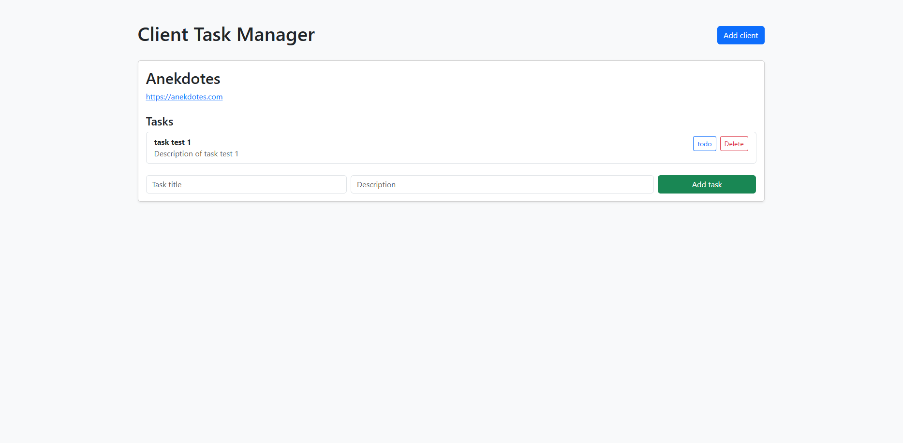
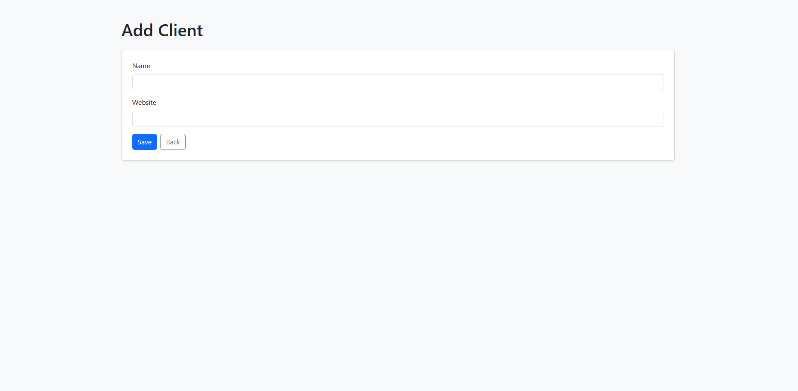
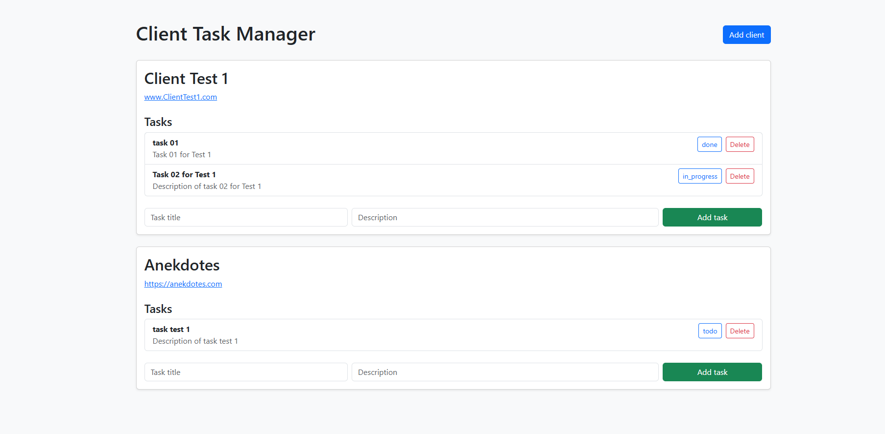

# Client Task Manager

A simple Full Stack web application built with Laravel and MySQL to manage clients and their tasks.

## Features

* Create clients
* Create tasks linked to clients
* Update task status
* Delete tasks
* AJAX status updates without page reload
* Responsive Bootstrap interface

## Technologies

* PHP 8.4
* Laravel 13
* MySQL
* Bootstrap 5
* JavaScript
* AJAX / Fetch API
* Git

## Database Relationship

```text
Client
 └── hasMany Tasks

Task
 └── belongsTo Client
```

## What I Learned

This project was built to practice:

* Laravel MVC architecture
* Eloquent ORM
* Database migrations
* One-to-Many relationships
* CRUD operations
* Bootstrap UI development
* AJAX and JSON responses
* Git workflow

## Installation

```bash
git clone https://github.com/JustinGendarme88/client-task-manager.git
cd client-task-manager

composer install

copy .env.example .env

php artisan key:generate

php artisan migrate
```

Configure MySQL credentials in `.env`.

Start the application:

```bash
php -S 127.0.0.1:8081 -t public
```

## Author

Justin Gendarme

## Screenshots

### Dashboard



### Add Client



### Task Management


